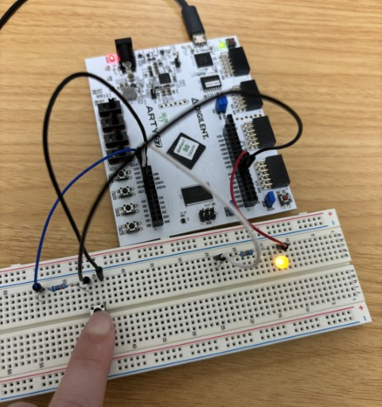
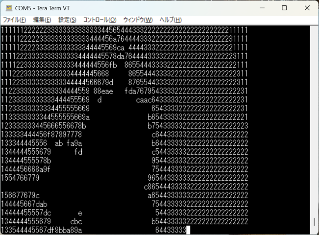

# ZKTC

The ZKTC project is a hobby project that involves designing a CPU, creating a compiler for it, and running various programs on the CPU.

The ZKTC (CPU) is a 16-bit CPU implemented in SystemVerilog and can run on an FPGA. It supports UART, GPIO, and interrupts. Programs written in ZKTC-C (a language similar to C) can be compiled using the ZKTC-C-com (compiler) and executed on the ZKTC.

# Demos

The `program/app/sample` folder contains several applications that can be executed using the Z-kernel (`program/kernel`).

Turn on the LED using GPIO



Hangman Game


Mandelbrot Set Plot



# Getting Started

## 1. Build CPU

The files required to build the FPGA image are the files under `src/` and `boot1.mem`, `boot2.mem`.`boot1.mem` and `boot2.mem` can be created in the `program/` folder using the `make` command.To create them, you need [zktc-c-com (compiler)](https://github.com/kkinos/zktc-c-com) and [zktc-asm (assembler)](https://github.com/kkinos/zktc-asm).

### Supported Boards

Currently, it has only been tested on the [Arty S7](https://digilent.com/reference/programmable-logic/arty-s7/start?srsltid=AfmBOoqxFrCdESt4ksl70eiFWwYsTQBADN3AJXtrOcHicnS3QMfPCqvx), but it should work on other FPGA boards as well.

## 2. Build App

Using the `make` command in the `program/` folder will generate `.bin` files in each folder under `program/app/sample`.

## 3. Load and Run

When you start ZKTC, you can enter commands via UART. When you enter the `load` command, it will wait for a transfer, so please transfer the application binary using XMODEM via UART. Once `Loaded successfully.` is displayed, you can start the application with the `run` command.

`serial terminal`

```
ZKTC boot loader started.
ZKTC project is a hobby project by kkinos.
For more details, https://github.com/kkinos/zktc
> load
Loaded successfully.
> run
```

## Test

Tests can be run by using the `make` command in each folder under `test/`. Icarus Verilog is required to run the tests.

# Documentation

- [ZKTC(CPU)](docs/zktc_document_en.md)

- [Z-kernel(Kernel)](docs/z_kernel_document_en.md)

# Tools

- [zktc-c-com](https://github.com/kkinos/zktc-c-com) : ZKTC-C compiler
- [zktc-asm](https://github.com/kkinos/zktc-asm) : ZKTC assembler
